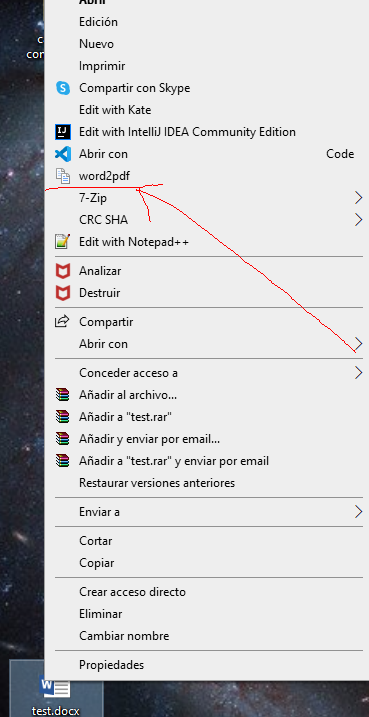
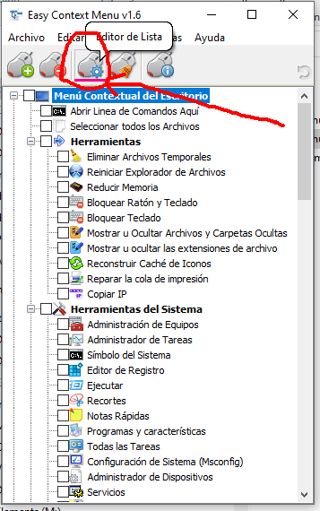
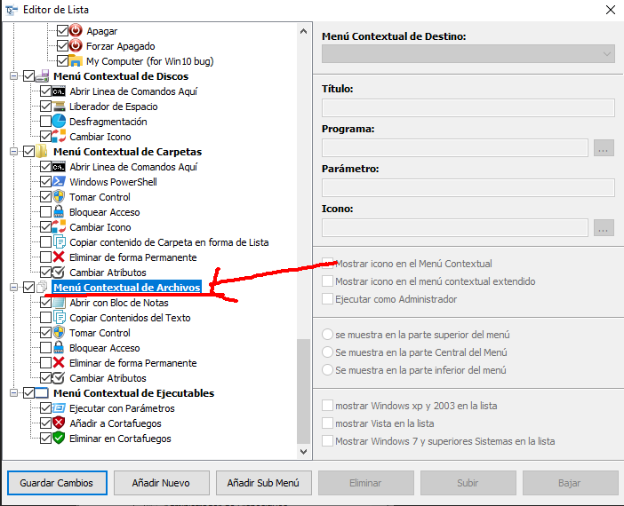
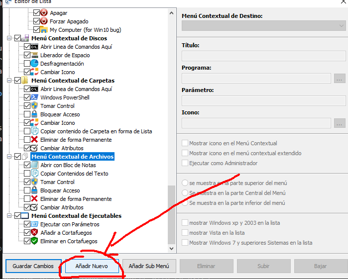
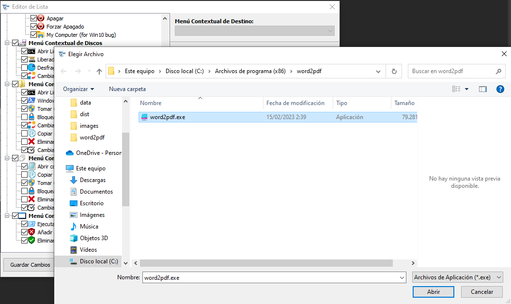
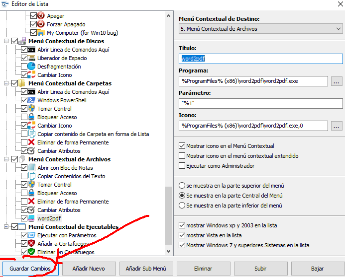
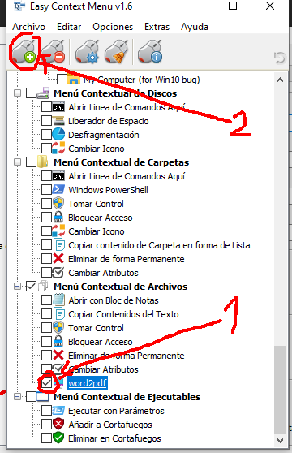

# Que es word2pdf

Es un programa que te permite convertir archivos de word a formato pdf y viceversa.

It is a program that allows you to convert word files to pdf format and vice versa.

Se puede ejecutar con la línea de comandos de windows.

It can be run with the windows command line.

# Instalación

El programa es un ejecutable de windows  no tienes que hacer nada.

The program is a windows executable you don't have to do anything.

Si quieres agregarlo al menú contextual de las opciones de los archivos:

If you want to add it to the context menu of file options:

Ejecuta el programa "EcMenu_x64.exe" que está dentro del comprimido "ec_menu" dentro de la carpeta data y pincha en lista.

Run the "EcMenu_x64.exe" program that is inside the "ec_menu" compressed inside the data folder and click on list.

Selecciona menú contextual de archivos.

Select file context menu.

Y pincha en "Añadir nuevo":

And click on "Add new":

Busca el programa:

Find the program::

Pincha en "guardar cambios":

Click on "save changes":

Por último marcha la casilla de tu programa y picha en aplicar cambios:

Finally, check the box of your program and click on apply changes:

# Programación

Para poder compilar el proyecto, tienes que tener python3.0 o superior y ejecutar el archivo pip-install.bat para instalar las depencias necesarias.

In order to compile the project, you need to have python3.0 or higher and run the pip-install.bat file to install the necessary dependencies.
